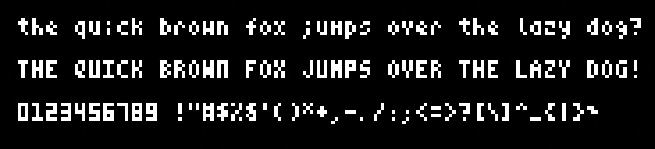

# 4x6 monochrome bitmap font for rendering

A simple and tiny 4x6 bitmap font.

[font4x6_basic.h](font4x6_basic.h) contains unicode points `U+0000` - `U+007F`.




> That second image have been scaled in 400% to improve visualization.

## Encoding

Every character in the font is encoded in 3 bytes.

Each byte represents 2 rows of a 4x6 grid and the least significant bit of each nibble corresponds to the first pixel in row.

E.g.: The character `'A'` (0x41 / 65) is encoded as `{ 0x25, 0x75, 0x50 }`

```
0x25 => 0010 1010 => .X..
                     X.X.
0x75 => 0000 0111 => XXX.
                     X.X.
0x05 => 0000 0101 => X.X.
                     ....
```

## Renderer

To visualize the font, a simple renderer is included in [`render.c`](render.c)

```sh
$ gcc render.c -o render
$ ./render 65
 X
X X
XXX
X X
X X
```

## Inspiration

This repository only exists thanks to:

- https://github.com/dhepper/font8x8
- https://alasseearfalas.itch.io/another-tiny-pixel-font-mono-3x5

## Projects using this font

- https://github.com/litecanvas/plugin-pixel-font - a plugin to display retro pixel fonts in the Litecanvas engine.

## LICENSE

This repository is (un)licensed under [Public Domain](LICENSE), so take it and do whatever you want with it. Credits are not required but much appreciated.
